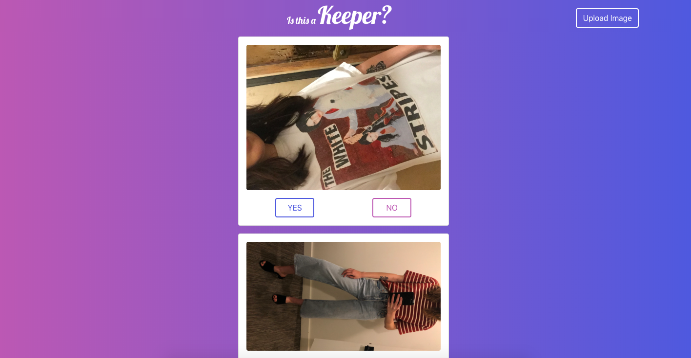

# Keeper

Keeper is a fashion application where users can interact in two ways. Users may request the opinions of other users by uploading images of items of clothing (whether it be tried on in a fitting room, on the hanger, or dug up from their closet), each image uploaded will be displayed on its own card where people can vote "Yes" or "No" on the question our app asks.. "Is this a keeper?" This is when users who are visiting as spectators can chime in their votes on whether the image uploaded is a keeper or not. Poll results will be displayed after each vote. Our app allows for only one vote to be made on each card unless the user decides to refresh the page wherein the app will reload with all the vote results hidden again. Our app allows for live uploads so you can continue to scroll down the page and continue voting on new uploads! [You can even find out what store an item is from and find the nearest store location near you (see 'Getting Started' below)]

# Getting Started

If you would like to access the name of the retailer where the uploader's item is being showcased, click 'Allow' when prompted for location access in order to see the nearest retailer near you.

After you've done so, simply navigate to 'Upload Image' to the right side of our navbar. You will be prompted to select an image from your desktop or phone photo library. Once your image is selected, you will be asked to input the name of the retailer for where you found your item. The app will populate the closest retailer to the user voting. As a voter, you can find out where an item was purchased by clicking on the image. This will trigger a response and display the name of the retailer along with the nearest location to your current location. You can vote on each uploaded item by clicking "Yes" or "No" on the corresponding image and see results appear!

# Deployment

You can visit our deployed site [here](https://melikalbasi.github.io/Keeper_App/).

# Built With

* [Google Firestore API](https://cloud.google.com/firestore/docs/reference/rest/) - Used to store images in our Firebase
* [Google Places API](https://developers.google.com/places/) - Used to generate nearby retailers
* [Magic](https://www.minimamente.com/example/magic_animations/) - Used to give visual feedback to users when events occur on the page
* [HTML] - markup language
* [CSS] - styling
* [Bootstrap] - website framework
* [JavaScript] - programming language
* [jQuery] - javascript library
* [Firebase] - cloud database

# Authors

* [Melika Kalbasi](https://github.com/melikalbasi)
* [Jacob Moore](https://github.com/jrmoore117)
* [Fernando Mendoza](https://github.com/FMendoza13)
* [Geri Craig](https://github.com/gericraig)

# License

This project is licensed under the MIT License - see the [LICENSE.md](LICENSE.md) file for details

# Acknowledgments

* Thank you to Melika's aunt Mona Samandari for the initial idea of Keeper! 
* Thank you to our TAs and Instructor for moral support and assistance when we were stuck.